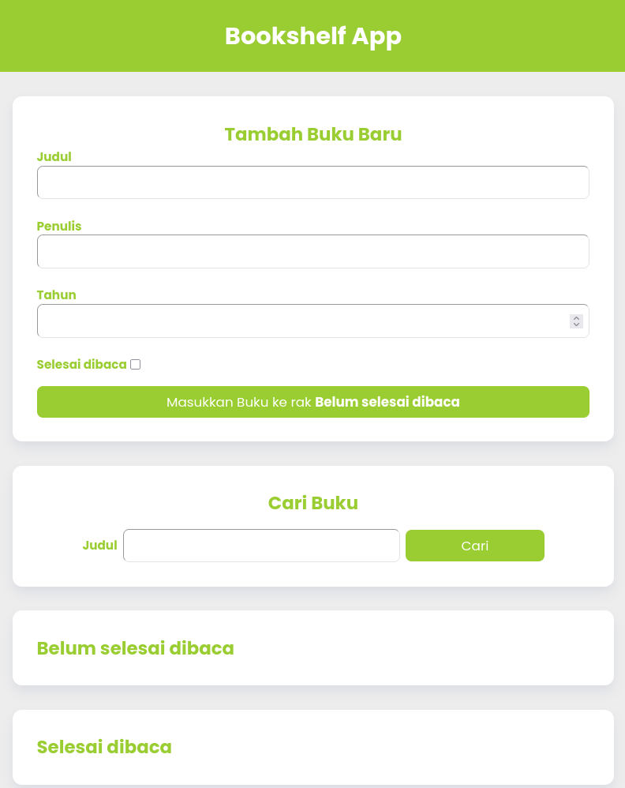

# Bookshelf App v1

## Overview



The Bookshelf App is a web application that allows users to manage their book collection. Users can add new books, search for existing books, and view lists of completed and incomplete books. The app provides a user-friendly interface and utilizes local storage to save book data.

## Features

- Add new books with title, author, year, and completion status.
- Search for books by title.
- View lists of completed and incomplete books.
- Edit and delete books from the collection.
- Responsive design with a clean and modern interface.

## Technologies Used

- HTML
- CSS
- JavaScript
- Local Storage API

## Installation

1. Clone the repository:
   ```bash
   git clone https://github.com/ssanudin/bookshelf-app-v1.git
   ```
2. Navigate to the project directory:
   ```bash
   cd bookshelf-app-v1
   ```
3. Open `index.html` in your web browser.

## Usage

- To add a new book, fill out the form in the "Tambah Buku Baru" section and click the "Masukkan Buku ke rak" button.
- To search for a book, enter the title in the "Cari Buku" section and click the "Cari" button.
- Books can be marked as completed or incomplete, and users can edit or delete books as needed.

## License

This project is licensed under the MIT License.

## Acknowledgments

- Inspired by various bookshelf management applications.
- Fonts used: [Poppins](https://fonts.google.com/specimen/Poppins)
